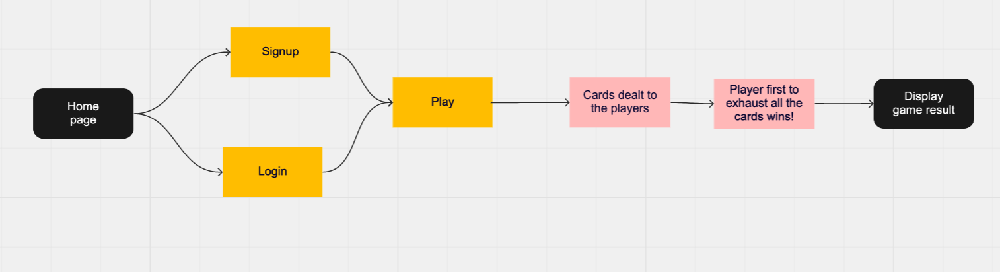

# Uno card game

Multiplayer uno card game.  
The goal of the game is to be the first one to get rid of all cards at hand.

### ⚙️ Technologies:

<li>Express</li>
<li>AJAX</li>
<li>Socket.io</li>

### 🔑 Database and user auth:

User authentication  
DB tables to store Users, games, user-games information.

### MVP

<li>2 players game.</li>
<li>User Auth</li>
<li>Storing game and players info</li>
<li>First player to exhaust all the cards is the winner.</li>

### Nice to have:

<li>Up to 4 players can play.</li>
<li>Introducing wild and skip cards.</li>
<li>Introduce points</li>
<li>First one to score 500 points is the winner.</li>

### 👥 User flow

### ERD

